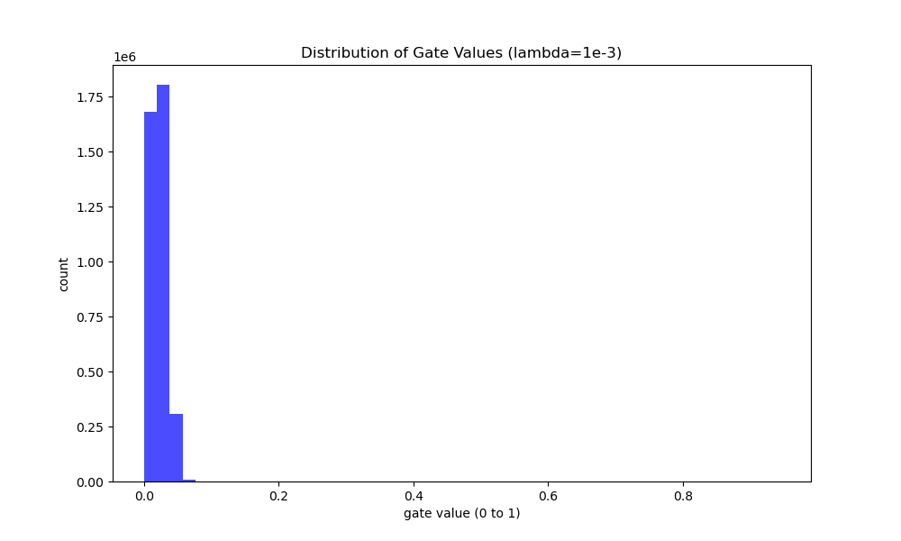

# Self-Pruning Neural Network

## Project Description

This project implements a self-pruning neural network in PyTorch. The network dynamically learns to prune its own weights during training using a learnable gating mechanism attached to each weight. A sparsity loss component, implemented via an L1 penalty on the sigmoid-activated gates, encourages the network to push gate values exactly to zero. This allows unnecessary connections to be effectively turned off while preserving task accuracy. The repository explores this trade-off between task loss and sparsity across different regularization factors (`lambda` values) on the CIFAR-10 dataset.

## Results Table

| Lambda | Test Accuracy | Sparsity Level (%) |
|--------|---------------|--------------------|
| 1e-5   | 56.71% | 3.00% |
| 1e-3   | 56.64% | 13.79% |
| 1e-1   | 48.00% | 13.96% |

*(Fill in these values using the output generated by `prunable_network.py`)*

## Gate Distribution Plot

The following histogram illustrates the distribution of the final gate values across all prunable layers for the best model (`lambda = 1e-3`). 

